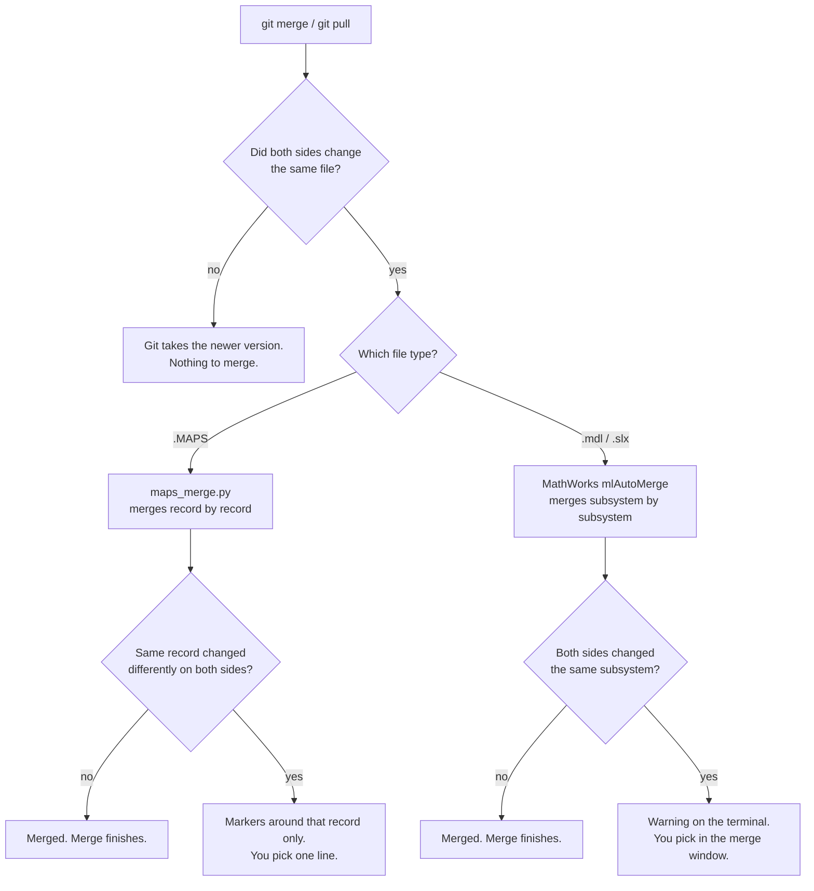
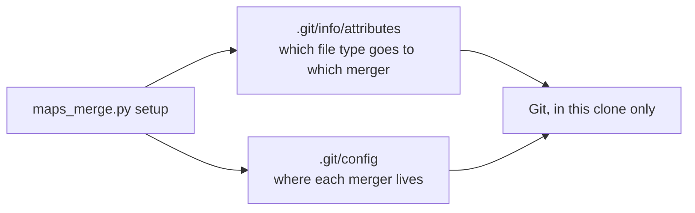
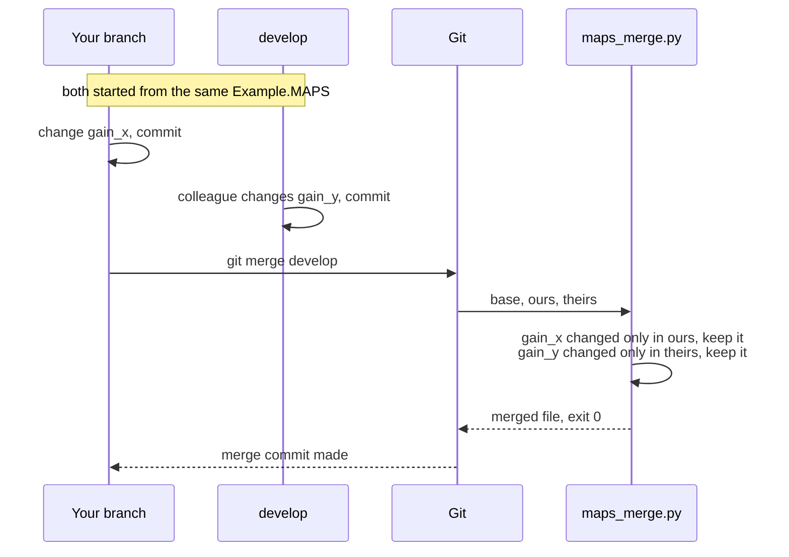

# Merging MAPS and model files with Git: local setup guide

This guide sets up merging of MAPS files and Simulink models in **your own
clone**. Nobody else is affected, and you can undo it at any time.

Today the repository marks `*.MAPS` and `*.mdl` as binary. When two people
change the same file, Git refuses to merge it and one person's work is thrown
away. After this setup:

- **MAPS files** are merged record by record by `maps_merge.py`.
- **Models** are merged by MathWorks' own `mlAutoMerge`, which ships with MATLAB.
- **Only a real clash stops the merge.** A clash is the same value changed
  differently on both sides, or the same subsystem changed on both sides.
  Nothing is dropped silently.

## Contents

1. How it works
2. What you need
3. Install, once per person
4. Connect a clone, once per clone
5. Prove it works
6. Daily work
7. Example: MAPS merge
8. Example: MAPS conflict
9. Example: model merge and the merge window
10. Undo and escape hatches
11. Updating the script
12. Rules that keep it safe
13. Troubleshooting
14. Removing it

---

## 1. How it works

You never run the merger by hand. Git runs it whenever a merge, pull, rebase
or `stash pop` has to combine two versions of the same file.



For every merge Git finds three versions by itself: the **base**, which is the
last version both branches shared, **ours**, your branch, and **theirs**, the
branch coming in. You only ever see one file in your folder.

### What the MAPS merger does

A MAPS file is plain text: one record per line, grouped by record type and
sorted. The merger reads every line as a record with an identity, for example
*object, parameter, dataset*. It then decides record by record:

| base | ours | theirs | result |
|---|---|---|---|
| A | A | A | A, unchanged, byte for byte |
| A | **B** | A | B, you changed it |
| A | A | **B** | B, they changed it |
| A | **B** | **B** | B, same change on both sides, kept once |
| A | **B** | **C** | **conflict**, both versions shown, you pick |
| A | deleted | A | deleted |
| A | deleted | **B** | **conflict**, delete against edit |
| none | **B** | none | B, added |
| history | +entry 1 | +entry 2 | both entries, in date order |
| version 17 | 18 | 25 | 25, the larger counter |

Untouched lines are copied exactly as they were. Changed lines are copied
exactly from the side that changed them. The file keeps the format the MAPS
editor wrote. Nothing is converted.

### What setup changes

Setup writes to two places, both inside your own clone. Nothing is committed
and nothing is shared.



---

## 2. What you need

| Item | How to check |
|---|---|
| Python 2.7 or 3.x | `python --version` |
| Git | `git --version` |
| MATLAB R2024b with Simulink, for models | in MATLAB: `version` |
| The **same MATLAB release** as everyone you merge models with | MathWorks' merger refuses models saved by different releases |

Note down two paths. You need them below.

| Placeholder in this guide | What it is | How to find it |
|---|---|---|
| `<MATLABROOT>` | the MATLAB install folder | in MATLAB, type `matlabroot` |
| `<SCRIPT>` | where you keep `maps_merge.py` | you choose it in step 3, for example `~/maps_merge.py` |

---

## 3. Install, once per person

1. Open `maps_merge.py` in this repository on GitHub, click **Raw**, and copy
   everything.
2. Paste it into a new file in a folder that will not move, for example your
   home folder, and save it as `maps_merge.py`.
3. Check it:

   ```
   python <SCRIPT> --version
   ```

   Expected: `maps_merge 1.3.0` or newer.

Git will remember this exact path. If you move the file later, run step 4 again.

---

## 4. Connect a clone, once per clone

Go into your clone of the repository and run:

```
cd <your clone>
python <SCRIPT> setup --apply --local-attributes --matlabroot <MATLABROOT>
```

Expected output, shortened:

```
# MATLAB merge tools will start with LD_PRELOAD=.../libkrb5support.so.0
#   (fixes 'libkrb5.so.3: undefined symbol: k5_buf_cstring' on RHEL8)
...
ok   git config merge.maps.driver
ok   git config merge.mlAutoMerge.driver
ok   git config mergetool.mlMerge.cmd
...
ok  wrote <your clone>/.git/info/attributes
```

There must be **no** `WARNING` line.

The `LD_PRELOAD` line matters on Linux. Without it, MathWorks' tools crash when
Git starts them, and every model merge would stop.

Then check that Git routes the files correctly:

```
git check-attr merge -- path/to/Example.MAPS
git check-attr merge -- path/to/Example.mdl
```

Expected:

```
path/to/Example.MAPS: merge: maps
path/to/Example.mdl: merge: mlAutoMerge
```

This applies to every branch in this clone. A new clone needs this step again.

---

## 5. Prove it works

This command copies your real MAPS file into a temporary folder, plays out 26
merge situations, including real `git merge`, `git diff` and `git rebase`, and
deletes everything afterwards. Your file is never modified.

```
python <SCRIPT> selftest path/to/Example.MAPS --git
```

Expected last line:

```
26 of 26 checks passed. Source file untouched.
```

To also check that MathWorks' merger runs on your model, still on temporary
copies only:

```
python <SCRIPT> selftest path/to/Example.MAPS --git --matlabroot <MATLABROOT> --mdl path/to/Example.mdl
```

---

## 6. Daily work

Almost nothing changes.

1. Unlock the MAPS file for editing the usual way, as today.
2. Edit in the MAPS editor and in Simulink. Save.
3. **Close the MAPS editor and Simulink before you pull or merge.** An editor
   that still holds the old version would overwrite the merge result when you
   save.
4. Commit as usual, with your ticket number.
5. Pull or merge as usual. Give merges a ticket number too, because the
   company commit hook rejects Git's automatic merge message:

   ```
   git merge <branch> -m "<TICKET> merge <branch>"
   ```

6. Read what the terminal prints. Sections 7 to 9 show what each message means.

---

## 7. Example: MAPS merge

You change `gain_x` on your branch. A colleague changes `gain_y` on develop.
You merge develop into your branch.



What the terminal shows:

```
maps_merge: path/to/Example.MAPS: 1 change(s) from ours, 1 from theirs, 0 conflict(s)
```

`0 conflict(s)` means done. Open the file in the MAPS editor. Both new values
are there.

You may also see:

```
maps_merge: ...: network_properties version_number: took the higher value 111
```

Both sides bumped the save counter. That is expected and not a conflict.

If you see `Fast-forward` instead, only one side had changed the file, so there
was nothing to combine. That is also fine.

---

## 8. Example: MAPS conflict

You set `gain_x` to `2.5`. The colleague set the same `gain_x` to `3.0`.

The terminal shows the exact record:

```
maps_merge: path/to/Example.MAPS: CONFLICT parameter_value [Controller.X | gain_x | | | Nominal | Default]: ours="2.5" theirs="3.0" base="1.0"
Automatic merge failed; fix conflicts and then commit the result.
```

Everything else in the file is already merged. Only that record is marked:

```
<<<<<<< ours
"parameter_value", "Controller.X", "gain_x", "", "", "Nominal", "Default", "2.5"
||||||| base
"parameter_value", "Controller.X", "gain_x", "", "", "Nominal", "Default", "1.0"
=======
"parameter_value", "Controller.X", "gain_x", "", "", "Nominal", "Default", "3.0"
>>>>>>> theirs
```

To resolve it:

1. Open the file in a **text editor**, not the MAPS editor.
2. Search for `<<<<<<<`.
3. Keep the one line you want. Delete every other line of that block, including
   the four marker lines.
4. Save, check the file, and mark it resolved:

   ```
   python <SCRIPT> check path/to/Example.MAPS
   git add path/to/Example.MAPS
   git commit -m "<TICKET> merge <branch>"
   ```

   `check` must end with `ok`. It reports any marker you missed.

---

## 9. Example: model merge and the merge window

### Changes in different subsystems

You add a block in **Controller**. The colleague adds a block in **Sensor**.
`git merge` pauses for a few seconds while MATLAB merges in the background,
then finishes. Open the model: both blocks are there.

### Changes in the same subsystem

Both of you changed something inside **Controller**. MathWorks' merger does not
guess. Git stops, and the terminal shows:

```
maps_merge: MODEL NOT MERGED AUTOMATICALLY: path/to/Example.mdl
  The model in your folder is only YOUR version. It has no conflict markers.
  Do not git add it yet, or the other side's changes are lost. First run:
    git mergetool --tool=mlMerge -- path/to/Example.mdl
```

> **Important:** at this point the model in your folder looks completely
> normal, but it only contains your side. If you `git add` it now, the other
> person's model changes are lost. Always open the merge window first.

Run the command from the message:

```
git mergetool --tool=mlMerge -- path/to/Example.mdl
```

The Three-Way Merge window opens:

```
┌──────────────┬──────────────┬──────────────┐
│   Theirs     │    Base      │    Mine      │   three read-only views
│  incoming    │  before      │  your        │
│  version     │  either      │  version     │
└──────────────┴──────────────┴──────────────┘
┌────────────────────────────────────────────┐
│ Target: the merged model being built       │   the one you work on
│ one row per changed block, line, parameter │
│ option buttons:  Theirs   Base   Mine      │
└────────────────────────────────────────────┘
```

In the Target pane:

1. **Red rows with a warning icon** are conflicts. Rows coloured like one side
   were merged automatically. Leave those alone.
2. For each red row, click the option button of the version you want: **Mine**
   for your block, **Theirs** for theirs. Each row is separate, so you can keep
   your block *and* theirs.
3. Resolve **blocks first, then lines**. A line can only connect to a block that
   is already in Target.
4. If the tool cannot combine something, for example a wire both of you
   changed, pick the closer version, or right-click and choose
   **Mark as Resolved**. You fix it by hand in step 6.
5. Click **Accept & Close**. The merged model is saved and staged.
6. Open the model in Simulink, add anything the tool could not combine, such as
   a missing wire, and save. If you changed it, run
   `git add path/to/Example.mdl` again.
7. Commit: `git commit -m "<TICKET> merge <branch>"`

If you close the window without accepting, Git asks
`Was the merge successful [y/n]?`. Answer `n`. The model stays unresolved and
you can open the window again.

---

## 10. Undo and escape hatches

| Situation | Command |
|---|---|
| In the middle of a merge, want to start over | `git merge --abort` |
| Merge finished, but you want it undone, not pushed yet | `git reset --hard ORIG_HEAD` |
| See what changed in a MAPS file, readable | `git diff -- path/to/Example.MAPS` |

`--hard` throws away uncommitted edits to tracked files. Untracked files are not
touched.

---

## 11. Updating the script

1. Replace the file at `<SCRIPT>` with the new version, at the same path.
2. Check it: `python <SCRIPT> --version`.
3. Run step 4 again in each clone. This is only needed when a new version
   changes the Git settings, or after a MATLAB upgrade, but running it again
   is always safe.

---

## 12. Rules that keep it safe

- **Never put the routing lines in the shared, committed `.gitattributes`.**
  Keep `*.MAPS binary` and `*.mdl binary` there. When a line names a merger
  that is not set up on a machine, Git does a plain text merge of that file,
  silently. Colleagues who have not run setup, GitHub's merge button, and
  servers would all do that. Setup writes the lines only into your clone's
  private `.git/info/attributes`.
- **Do not `git add` a model before resolving it in the merge window.**
- **Close the MAPS editor and Simulink before merging or pulling.**
- **Everyone who merges a model must use the same MATLAB release.**
- **Merge on your own machine, then push.** GitHub's merge button never runs
  these mergers.
- **Keep `<SCRIPT>` at a fixed path.**

---

## 13. Troubleshooting

| What you see | What it means | What to do |
|---|---|---|
| `Fast-forward` | Only one side changed the file. There was nothing to merge. | Nothing. |
| No `maps_merge:` line during a merge | The MAPS file changed on one side only, or setup was not run in this clone. | Run `git check-attr merge -- path/to/Example.MAPS`. It should say `merge: maps`. |
| `Commit error` about the commit message, after a merge | The company hook rejected Git's automatic merge message. The merge itself worked. | `git commit -m "<TICKET> merge <branch>"` |
| `error: Your local changes ... would be overwritten by merge` | You have uncommitted edits to that file. | Commit them first, or `git stash`, merge, then `git stash pop`. |
| `WARNING ... merge driver 'X', which is not configured` | The attributes file routes files to a merger this clone does not have. | Run step 4 again with `--matlabroot`. |
| `libkrb5.so.3: undefined symbol: k5_buf_cstring` | MATLAB's tools were started without the library fix. | Run step 4 again with `--matlabroot`, and check the `LD_PRELOAD` line appears. |
| `MODEL NOT MERGED AUTOMATICALLY` | Same subsystem changed on both sides, or the model merger could not run. | Section 9. Note which rows are red, which shows why. |
| `key for ... widened` | Information only. Two records shared an identity, so a wider one was used. | Nothing. |
| `cannot merge, ... malformed record` | A line in one version is not a valid MAPS record. Your file is untouched. | Fix that line, commit, merge again. |
| Merge window opens although you changed different subsystems | Something shared also changed, such as a port on the parent subsystem or the model's version number. | Resolve in the window. Nothing is lost. |

---

## 14. Removing it

In the clone, delete the attributes file **first**, then remove the settings:

```
rm .git/info/attributes
git config --remove-section merge.maps
git config --remove-section diff.maps
git config --remove-section merge.mlAutoMerge
git config --remove-section mergetool.mlMerge
git config --unset mergetool.keepBackup
```

Delete the attributes file first. An attribute that names a merger you have
already removed makes Git text-merge that file.
