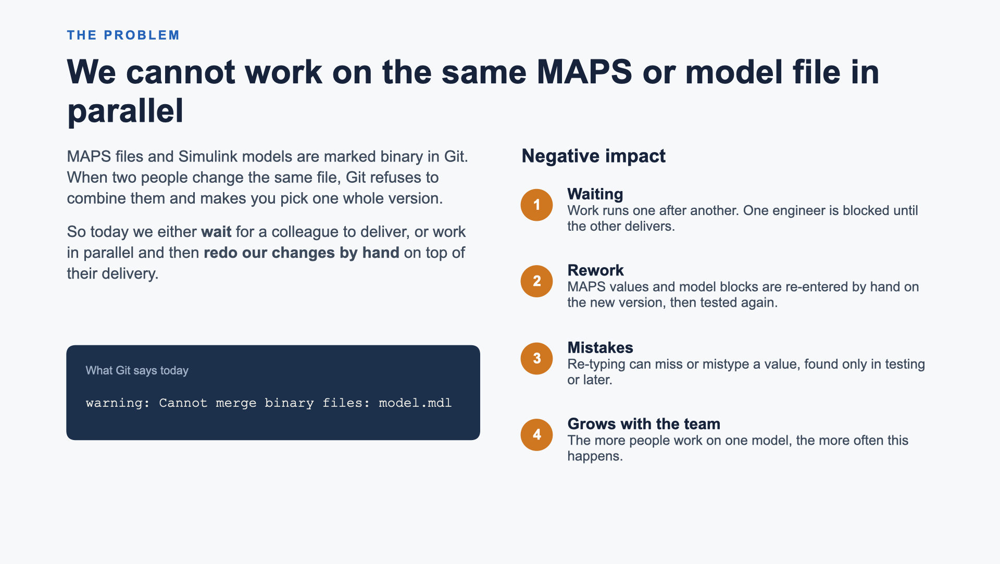
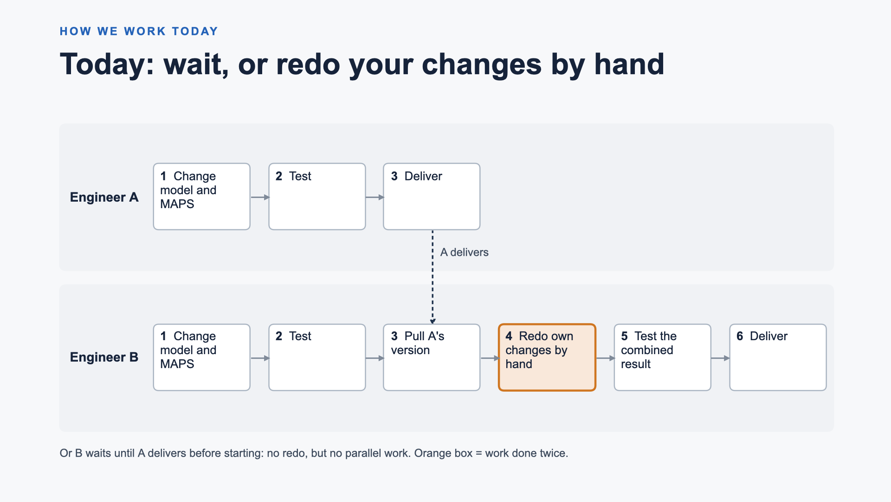
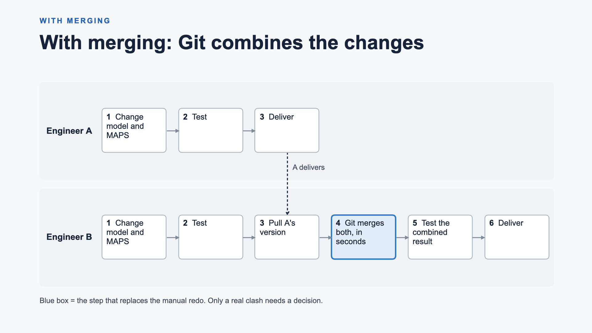
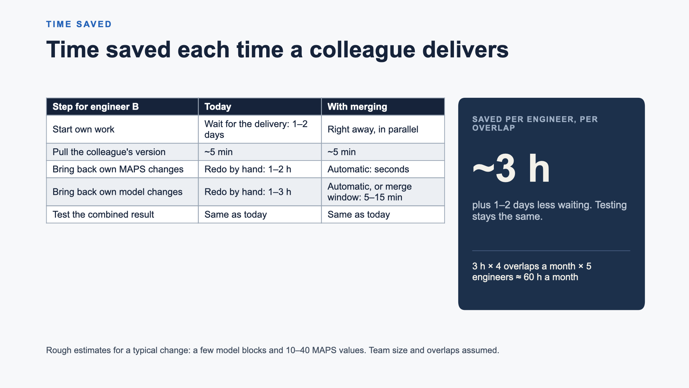
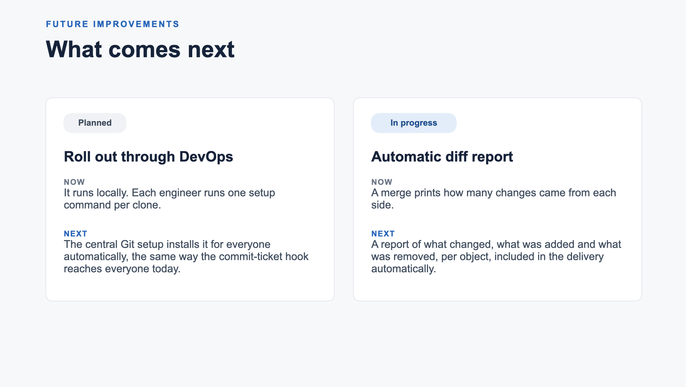

# Slides: Parallel Model Merging

Five slides. For each one: the picture, which you can screenshot or crop
directly from this page, then all of its text, ready to copy and paste.

Also available: [the PowerPoint file](Parallel_Model_Merging.pptx), and the
online deck at https://claude.ai/artifact/BKRANbQay3A3K8AXXLCCJq (needs a
claude.ai login).

---

## Slide 1. The problem



**Eyebrow:** THE PROBLEM

**Title:** We cannot work on the same MAPS or model file in parallel

**Left side:**

MAPS files and Simulink models are marked binary in Git. When two people change the same file, Git refuses to combine them and makes you pick one whole version.

So today we either **wait** for a colleague to deliver, or work in parallel and then **redo our changes by hand** on top of their delivery.

What Git says today:

```
warning: Cannot merge binary files: model.mdl
```

**Right side: Negative impact**

1. **Waiting.** Work runs one after another. One engineer is blocked until the other delivers.
2. **Rework.** MAPS values and model blocks are re-entered by hand on the new version, then tested again.
3. **Mistakes.** Re-typing can miss or mistype a value, found only in testing or later.
4. **Grows with the team.** The more people work on one model, the more often this happens.

**Speaker notes:** Both file types are marked binary in our repository, so Git never tries to combine two versions. The result is that we either wait for each other, or we work in parallel and then redo our own changes by hand on top of the colleague's delivery and test again. That costs time, and re-typing values by hand is where mistakes creep in.

---

## Slide 2. How we work today



**Eyebrow:** HOW WE WORK TODAY

**Title:** Today: wait, or redo your changes by hand

**Diagram, two lanes:**

| | 1 | 2 | 3 | 4 | 5 | 6 |
|---|---|---|---|---|---|---|
| **Engineer A** | Change model and MAPS | Test | Deliver | | | |
| **Engineer B** | Change model and MAPS | Test | Pull A's version | **Redo own changes by hand** (orange) | Test the combined result | Deliver |

A dashed arrow labelled "A delivers" runs from A's step 3 down to B's step 3.

**Footer:** Or B waits until A delivers before starting: no redo, but no parallel work. Orange box = work done twice.

**Speaker notes:** Two engineers change the same model and MAPS file. A delivers first. B has already made and tested a change, but Git cannot combine the two versions, so B pulls A's version and re-enters all of their own changes by hand before testing again. The orange step is pure rework. The alternative is that B simply waits for A, which avoids the rework but means no parallel work at all.

---

## Slide 3. With merging



**Eyebrow:** WITH MERGING

**Title:** With merging: Git combines the changes

**Diagram, two lanes:**

| | 1 | 2 | 3 | 4 | 5 | 6 |
|---|---|---|---|---|---|---|
| **Engineer A** | Change model and MAPS | Test | Deliver | | | |
| **Engineer B** | Change model and MAPS | Test | Pull A's version | **Git merges both, in seconds** (blue) | Test the combined result | Deliver |

A dashed arrow labelled "A delivers" runs from A's step 3 down to B's step 3.

**Footer:** Blue box = the step that replaces the manual redo. Only a real clash needs a decision.

**Speaker notes:** Same two engineers, same work. The only difference is step 4: instead of redoing changes by hand, B pulls and Git combines both versions. MAPS files are merged record by record by our new merge tool, and models by MathWorks' own merge tool, which merges changes in different subsystems automatically. Only a real clash, the same value or the same subsystem changed by both, needs a person's decision, and nothing is dropped silently. Both engineers can work in parallel from the start.

---

## Slide 4. Time saved



**Eyebrow:** TIME SAVED

**Title:** Time saved each time a colleague delivers

**Table:**

| Step for engineer B | Today | With merging |
|---|---|---|
| Start own work | Wait for the delivery: 1–2 days | Right away, in parallel |
| Pull the colleague's version | ~5 min | ~5 min |
| Bring back own MAPS changes | Redo by hand: 1–2 h | Automatic: seconds |
| Bring back own model changes | Redo by hand: 1–3 h | Automatic, or merge window: 5–15 min |
| Test the combined result | Same as today | Same as today |

**Dark card on the right:**

- SAVED PER ENGINEER, PER OVERLAP
- **~3 h**
- plus 1–2 days less waiting. Testing stays the same.
- 3 h × 4 overlaps a month × 5 engineers ≈ 60 h a month

**Footer:** Rough estimates for a typical change: a few model blocks and 10–40 MAPS values. Team size and overlaps assumed.

**Speaker notes:** These are rough estimates, not measurements. They assume a typical change of a few model blocks with their wiring plus 10 to 40 MAPS values. Redoing the MAPS part by hand, finding what changed, unlocking the file and re-entering values, takes about 1 to 2 hours. Redoing the model part, re-adding blocks and wiring, re-running the XML converter and re-importing into MAPS, takes about 1 to 3 hours. With merging the MAPS file merges in seconds, and a model that needs the merge window takes 5 to 15 minutes. Testing is the same either way. That is roughly 3 hours per engineer each time a delivery overlaps their work, plus 1 to 2 days less waiting. The monthly figure assumes 5 engineers with 4 overlapping deliveries each per month; replace these with our real numbers.

---

## Slide 5. Future improvements



**Eyebrow:** FUTURE IMPROVEMENTS

**Title:** What comes next

**Left card. Status: Planned. Roll out through DevOps**

- **Now:** It runs locally. Each engineer runs one setup command per clone.
- **Next:** The central Git setup installs it for everyone automatically, the same way the commit-ticket hook reaches everyone today.

**Right card. Status: In progress. Automatic diff report**

- **Now:** A merge prints how many changes came from each side.
- **Next:** A report of what changed, what was added and what was removed, per object, included in the delivery automatically.

**Speaker notes:** Two improvements. First, rollout: today each engineer sets it up locally with one command; next, the team that manages our Git setup can install it centrally, exactly like the commit-ticket hook, so everyone gets it without doing anything. Second, already in progress: an automatic diff report after every merge that lists what changed, what was added and what was removed, per object, so it can go into the delivery without extra work.

---

## Colours used, to rebuild the slides in your own template

| Use | Colour |
|---|---|
| Dark text, dark card | `#16233A` |
| Body text | `#3D4A5C` |
| Page background | `#F7F8FA` |
| Lane background | `#ECEFF3` |
| Blue accent, "with merging" | `#2563B8`, fill `#DCE8F7` |
| Orange accent, "redo by hand" | `#C2621A`, fill `#F7E3D2` |
| Font | Arial |
